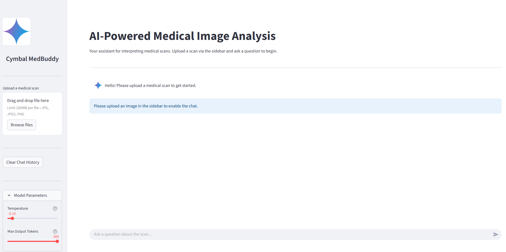
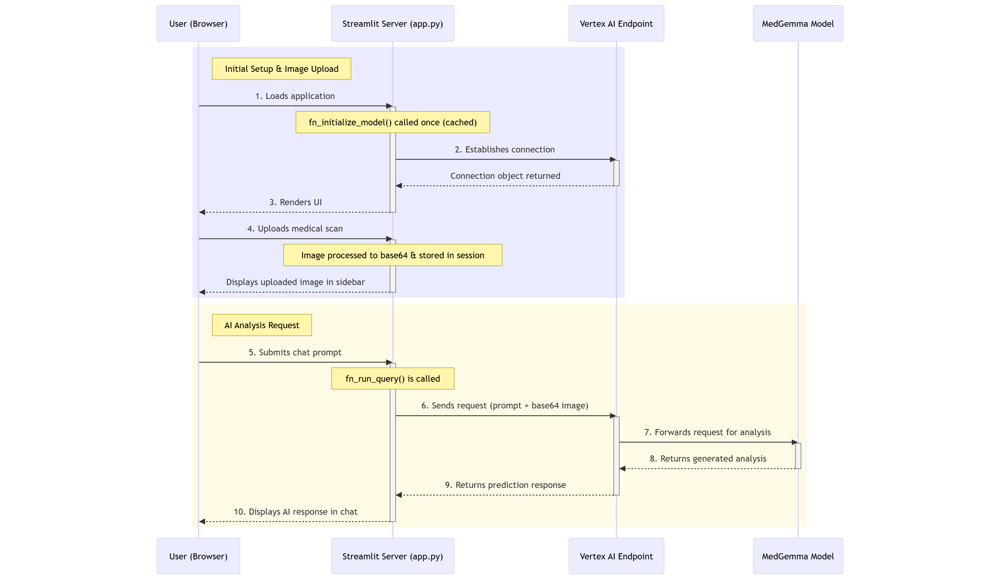
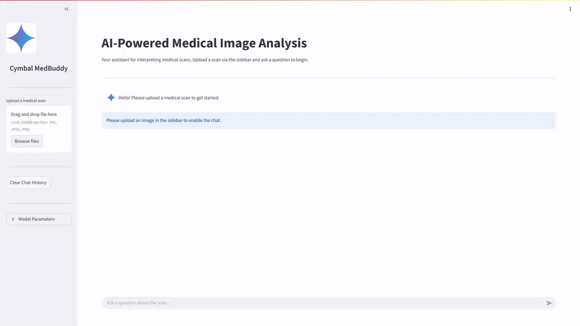
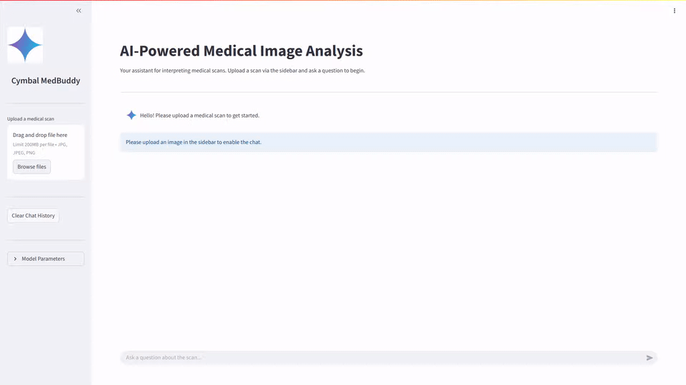
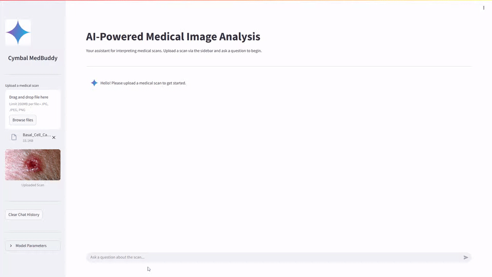

# Cymbal MedBuddy: AI-Powered Medical Image Analysis

**A Streamlit application leveraging Google's MedGemma model on Vertex AI for real-time analysis of medical scans.**



---

## 📖 Overview

Cymbal MedBuddy is a multi-modal AI assistant designed to aid radiologists, medical researchers, and students in the interpretation of diagnostic images. Users can upload a variety of medical scans (X-rays, MRIs, CTs, etc.) and engage in an interactive chat to ask specific questions about the image. The application provides detailed, clinically relevant analysis by combining the visual data from the scan with the user's textual prompts.

The backend is powered by **MedGemma**, a state-of-the-art vision-language model from Google, deployed on a dedicated **Vertex AI Endpoint**. The frontend is a user-friendly and responsive interface built with **Streamlit**.

### Project Structure

Below is the directory structure of the project:


```text
.
├── .gcloudignore                        # Specifies files to ignore for Google Cloud deployments.
├── .gitignore                           # Specifies files to ignore for Git version control.
├── .env                                 # Holds environment variables for local development.
├── app.py                               # The main Streamlit application script.
├── images/
│   ├── app/                             # Contains icons and images used by the app.
│   └── docs/                            # Contains images used in the documentation.
│   └── sample_medical_images/           # Contains sample images to test.
├── README.md                            # This documentation file.
└── requirements.txt                     # Lists the Python dependencies.
```

## ✨ Key Features

- **Multi-Modal Chat**: Accepts both an image (scan) and text prompts for contextual analysis.
- **Interactive Interface**: Real-time, conversational interaction with the AI model.
- **Expert-Level Analysis**: Leverages a specialized medical foundation model (MedGemma) for high-quality insights.
- **Adjustable Model Parameters**: UI controls for `Temperature` and `Max Output Tokens` to fine-tune model creativity and response length.
- **Chat History Management**: Easily clear the conversation or export the entire chat history to a `.txt` file for record-keeping.
- **Robust Error Handling**: Gracefully handles potential API errors (e.g., permissions, quotas) and provides clear feedback to the user.
- **Efficient & Scalable Backend**: Caches the Vertex AI model connection for low-latency responses.

---

## 🏗️ System Architecture

The application operates on a simple yet powerful client-server architecture:

1.  **Frontend (User's Browser)**: The user interacts with the **Streamlit** web interface to upload an image and send messages.
2.  **Web Server (Streamlit)**: The Python-based Streamlit server running `app.py` manages the UI, session state, and user input.
3.  **Backend (Google Cloud)**: When a user sends a prompt, the Streamlit backend constructs a request containing the prompt and the base64-encoded image.
4.  **Vertex AI Endpoint**: The request is sent to a dedicated, scalable endpoint hosting the MedGemma model.
5.  **MedGemma Model**: The model processes the image and text, generates a clinical analysis, and sends the response back through the chain.


---

## 📊 Workflow Sequence Diagram

The following diagram illustrates the end-to-end data flow, from the user's initial interaction to the final AI-generated response.



---

## 🚀 Setup and Deployment Guide

Follow these steps to set up the environment, deploy the model, and run the application.

### 1. Prerequisites

- **Google Cloud Account**: With billing enabled.
- **Google Cloud SDK**: `gcloud` CLI installed and authenticated (`gcloud auth login`, `gcloud config set project YOUR_PROJECT_ID`).
- **APIs Enabled**: Enable the Vertex AI API in your GCP project.
- **Python 3.10+** and `pip`.
- **Git**: For cloning the repository.

### 2. Deploy the MedGemma Model on Vertex AI

The core of this application is the MedGemma model. You must first deploy it from the Model Garden to a Vertex AI Endpoint.

1.  Navigate to the **Model Garden** in the Google Cloud Console.
2.  Search for and select **MedGemma**.
3.  Click **Deploy**. You will be prompted to select a model variant. For this project, we use `google/medgemma-4b-it`.
4.  Click **Deploy** again and configure the endpoint:
    -   **Endpoint Name**: Give it a descriptive name (e.g., `medgemma-endpoint`).
    -   **Region**: Select a region, for example, `us-central1`.
    -   **Machine Type**: For optimal performance, select a GPU-accelerated machine type. The `g2-standard-24` with `2 x NVIDIA_L4` GPUs is a recommended configuration.
5.  Click **Deploy**. The deployment will take several minutes.
6.  Once deployed, navigate to **Vertex AI > Endpoints**. Click on your new endpoint and **note down its ID and Region**. You will need these for the next step.
  

You can also use the following command to deploy the endpoint. Replace `<YOUR_PROJECT_ID>` with your project id. Region used is `us-central1`.

```bash
gcloud auth login

gcloud ai model-garden models deploy \
--model="google/medgemma@medgemma-4b-it" \
--region="us-central1" \
--project="<YOUR_PROJECT_ID>" \
--accept-eula \
--machine-type="g2-standard-24" \
--accelerator-type="NVIDIA_L4" \
--container-image-uri="us-docker.pkg.dev/vertex-ai/vertex-vision-model-garden-dockers/pytorch-vllm-serve:20250430_0916_RC00_maas" \
--use-dedicated-endpoint \
--endpoint-display-name="google_medgemma-4b-it-mg-one-click-deploy"
```

### 3. Configure Environment Variables

The application uses a `.env` file to securely manage credentials. Create a file named `.env` in the root of the project directory with below details.
- Replace `your-gcp-project-id` with the correct project id.
- Replace `<your-endpoint-id>` with model endpoint id.
- Check for the region.

```env
GCP_PROJECT_ID="your-gcp-project-id" # Change to your GCP project id
GCP_REGION="us-central1" # The region of your project, e.g., us-central1
MODEL_ENDPOINT_ID=<your-endpoint-id> # The ID of the Vertex AI Endpoint you deployed
MODEL_ENDPOINT_REGION="us-central1" # The region where your endpoint is deployed
```

### 4. Local Development

To run the application on your local machine for testing:

1.  **Clone the repository:**
    ```bash
    git clone <your-repository-url>
    cd medgemma-cymbal-medbuddy
    ```

2.  **Create a virtual environment:**
    ```bash
    python -m venv venv
    source venv/bin/activate  # On Windows use `venv\Scripts\activate`
    ```

3.  **Install dependencies:** Create a `requirements.txt` file with the following content:
    ```txt
    google
    google-cloud-core
    google-cloud-aiplatform
    streamlit
    gunicorn
    python-dotenv
    logging
    Pillow
    ```
    Then, install the packages:
    ```bash
    pip install -r requirements.txt
    ```

4.  **Run the Streamlit app:**
    ```bash
    streamlit run app.py
    ```
    Click on the URL displayed to open the application.

### 5. Run on Google Cloud Shell
To run the application on Google Cloud Shell:

1.  **Activate the Cloud Shell:**
   
    - From the Google Cloud Console click on the **Cloud Shell**.
    - Run `gcloud auth list` in Cloud Shell.
    - Run `gcloud config set project <PROJECT_ID>` to set your project id. Provide correct project id.
    - 

2.  **Clone the repository:**
    ```bash
    git clone <your-repository-url>
    cd medgemma-cymbal-medbuddy
    ```

    Make sure to change the `.env` file with required parameters.

3.  **Run the application:**
   
    - Use [uv](https://docs.astral.sh/uv/) (Python's extremely fast package and project manager) to run the application. It comes pre-installed in Cloud Shell. Create a virtual environment using `uv venv`
    - Run `uv pip install -r requirements.txt` to install the dependencies.
    - Start the application using `uv run streamlit run app.py --server.port=8080 --server.enableCORS=false` (disabling `--server.enableCORS` for testing as it interferes with Cloud Shell).
    - Click `Web Preview` to access the application.

### 6. Other ways of running the application:

For production purposes, you can deploy the application on [Cloud Run](https://cloud.google.com/run?e=0?utm_source%3Dlinkedin) or [App Engine](https://cloud.google.com/appengine?e=0?utm_source%3Dlinkedin). Make sure IAM roles are provided correctly following best practices. Follow official documentation for more details.

---


## ⚙️ Code Deep Dive

The application's logic is contained within `app.py`. Here are some key components:

- **`fn_initialize_model()`**: This function uses the `@st.cache_resource` decorator. This is a critical optimization that tells Streamlit to run this function only once, establishing the connection to the Vertex AI endpoint and caching the connection object. This prevents costly re-initialization on every user interaction, making the app significantly faster.

- **`fn_run_query()`**: This is the core AI interaction function.
  - **System Prompt**: It constructs a detailed `system_instruction` that guides the MedGemma model to behave as a medical imaging expert. This is a key aspect of prompt engineering that ensures high-quality, consistent, and safe responses.
  - **Payload Formatting**: It packages the system prompt, user's text prompt, and the base64-encoded image into the JSON payload format expected by the Vertex AI API.
  - **Error Handling**: It includes specific `except` blocks for common `google.api_core` exceptions, providing targeted and useful error messages to the user and logs.
- **`st.session_state`**: Streamlit's session state is used extensively to maintain the application's state across user interactions (reruns).
  - `st.session_state.messages`: A list that stores the entire chat history.
  - `st.session_state.img_b64`: Stores the uploaded image so it doesn't need to be re-processed.
  - `st.session_state.temperature` & `st.session_state.max_tokens`: These are linked directly to the UI sliders, allowing user settings to persist.

---

## ⚙️ Sample Outputs







## 🔗 References

- https://deepmind.google/models/gemma/medgemma/
- https://research.google/blog/medgemma-our-most-capable-open-models-for-health-ai-development/
- https://developers.google.com/health-ai-developer-foundations/medgemma
- https://developers.google.com/health-ai-developer-foundations/medgemma/get-started
- https://developers.google.com/health-ai-developer-foundations/medgemma/model-card
- https://cloud.google.com/model-garden?e=0?utm_source%3Dlinkedin
- https://cloud.google.com/vertex-ai/docs/general/deployment

---


